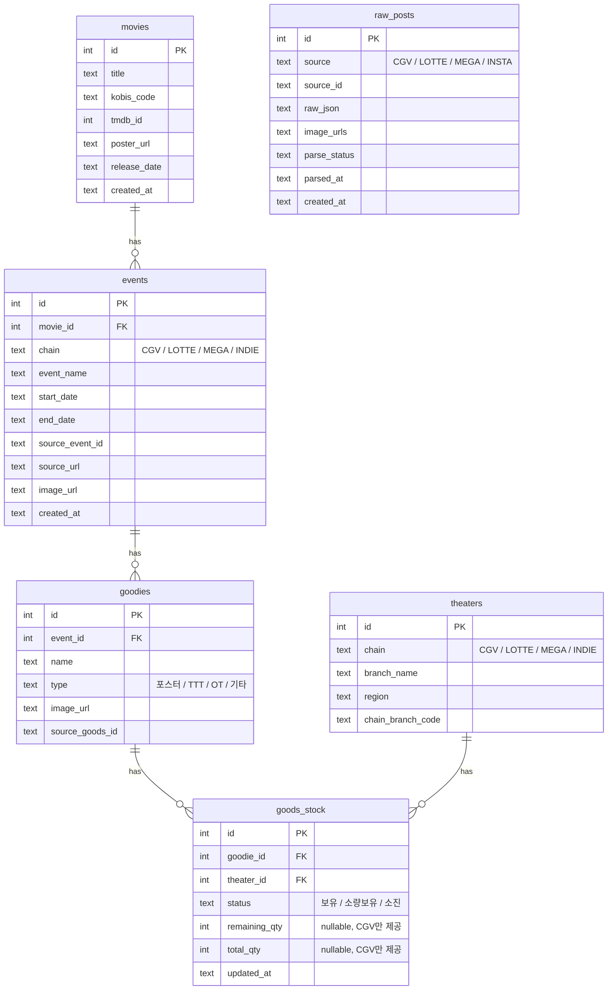
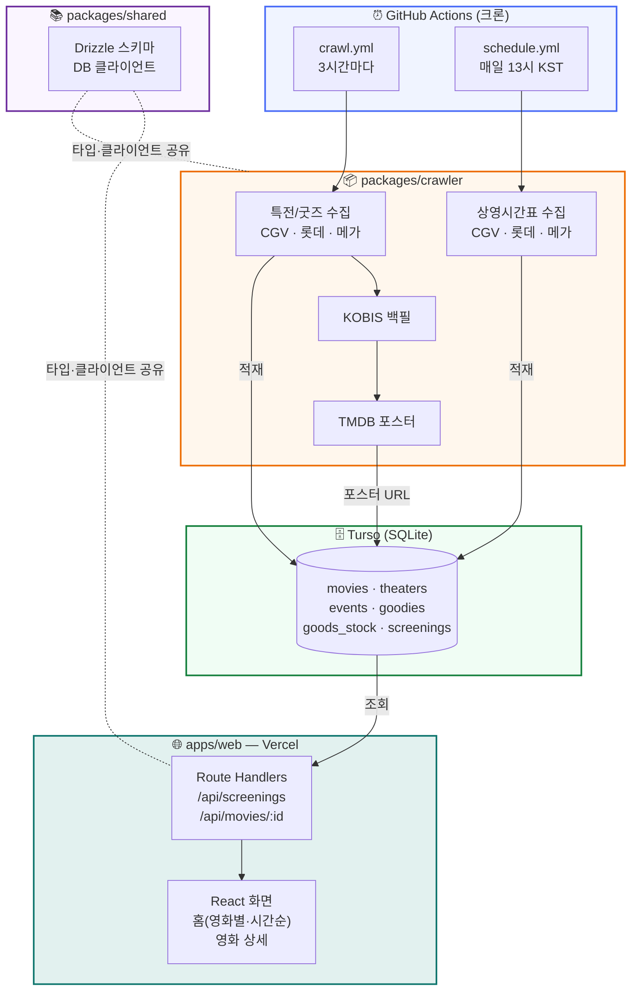

# cinemo

영화관별 특전(굿즈) 정보와 소진 현황을 한눈에 모아보는 캘린더 서비스

**🔗 서비스: https://mameil-cinemo.vercel.app**

## What

- CGV, 롯데시네마, 메가박스의 특전/굿즈 이벤트를 자동 수집
- 독립·예술영화관 인스타그램 피드에서 특전 공지를 자동 수집 (Apify + LLM 비전 파싱)
- 지점별 굿즈 소진 현황 실시간 연동
- 포스터 중심 UI로 일별/주간 캘린더 제공

## Tech Stack

| 항목 | 기술 |
|---|---|
| Frontend | Next.js, PWA |
| Backend | Serverless (Vercel) |
| DB | Turso (SQLite) |
| Crawler | TypeScript batch (GitHub Actions cron) |
| Storage | Cloudflare R2 |
| Language | TypeScript (monorepo) |

## ERD



## Architecture



## Project Structure

```
cinemo/
├── apps/web/            # Next.js — 캘린더 UI + 조회 API
├── packages/crawler/    # 크롤링 · 정제 · DB 적재
├── packages/shared/     # 공유 타입 · DB 스키마
├── docs/                # 설계서 · TODO
└── .github/workflows/   # GitHub Actions 크론
```
