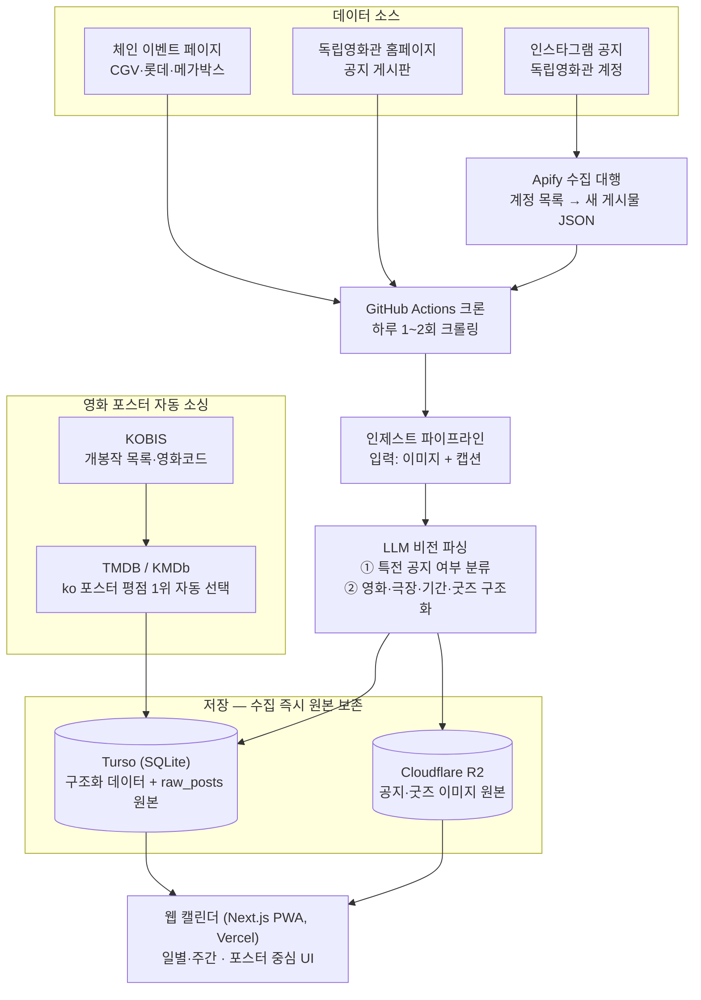

# 영화 특전 캘린더 프로젝트

날짜/주간 단위로 **어떤 영화관에서 어떤 영화가 무슨 특전(굿즈)을 주는지** 모아보는 서비스.
UI는 예매앱처럼 **포스터 중심** — 영화는 대표 포스터로 표현하고, 굿즈(TTT·오리지널 티켓·포스터 특전)도 이름만이 아니라 **실물 이미지 썸네일**로 함께 보여준다.

> 이 문서는 Claude와의 상담에서 결정된 내용을 세션별로 누적 기록하는 문서.

---

## 전체 설계도 (2026-07-07 기준)



- 핵심 원칙 1: 어떤 소스든 최종 입력은 "이미지 + 캡션"으로 동일한 인제스트 파이프라인에 모인다 (소스 추가/교체 쉬움)
- 핵심 원칙 2: **사람 개입 0** — 수집·파싱·포스터 선택까지 전부 자동, 관리자 화면 없음
- 핵심 원칙 3: 수집 시점에 원본을 즉시 저장 (텍스트·JSON은 Turso `raw_posts`, 이미지는 R2) → 지난 특전 아카이브는 자연히 확보

---

## 결정사항 기록

### 2026-07-07 — 방향성 확정

#### 아키텍처
```
데이터 소스 (체인 이벤트 페이지 · 인스타 · 배급사 공지)
  → 수집 크롤러 (GitHub Actions 크론, 하루 1~2회)
  → 파싱·정규화 (LLM 비전으로 공지 이미지 구조화)
  → Turso (SQLite, 이미지는 URL만 저장)
  → 웹 캘린더 (일별·주간 특전 조회)
```

#### 기술 스택
| 항목          | 결정                         | 비고                                                  |
| ----------- | -------------------------- | --------------------------------------------------- |
| DB          | ✅ Turso (SQLite)           | 무료 5GB로 충분. 이미지 blob 저장 금지, URL만                    |
| 크롤러 실행      | ✅ GitHub Actions 크론        | ~~Render~~ 대체. 상시 서버 불필요, 무료 슬립 문제 회피               |
| 프론트 호스팅     | Vercel 또는 Cloudflare Pages | 무료 플랜                                               |
| 이미지 판독      | ✅ LLM 비전 API (Claude 등)    | ~~네이버 OCR~~ 대체 (단, CLOVA OCR General은 별도 프로젝트에서 실증 완료 — 한국어 ~97% 정확도, 좌표 기반 구조 파싱 가능, 월 100건 무료. 비정형 소스 보조용 후보) |
| 굿즈 이미지 아카이브 | Cloudflare R2 (10GB 무료) 검토 | 이벤트 종료 후 원본 이미지가 내려가는 문제 대비                         |

#### 이미지 소싱 전략 (OCR을 검토했던 진짜 이유 = 포스터/굿즈 사진 확보)
- **영화 대표 포스터**: TMDB API — 영화당 포스터 후보 전체 조회 가능(`/movie/{id}/images`), 언어 태그(ko 필터)와 평점 제공
	- 기본값: 한국어 포스터 중 평점 1위 자동 선택
	- 관리자 화면에서 후보 목록 보고 수동 교체 가능
	- CDN 핫링크 허용(출처 표기 필요), 해상도는 URL로 조절
- **국내 독립·예술영화** (TMDB에 없는 경우): KMDb(한국영상자료원) API — 무료, 포스터·스틸 URL 제공
- **개봉작 목록**: KOBIS(영진위) API — 포스터는 없음, KOBIS 영화코드로 KMDb와 연동
- **굿즈 실물 사진**: 공지 자체가 소스. 체인 이벤트 상세 페이지의 굿즈 이미지 URL을 크롤러가 함께 저장
- **LLM 비전의 역할**: 공지 이미지 1장 → {영화, 주차, 굿즈 종류(TTT/OT/포스터), 기간, 지점} 구조화 + 굿즈 실물 사진인지 분류

#### 데이터 수집 우선순위
1. ✅ **CGV·롯데시네마·메가박스 공식 이벤트 페이지** — 특전 정보 대부분 커버, 내부 JSON API 존재 가능성 높음 → MVP는 여기서 시작
2. **독립·예술영화관** — 초기엔 관리자 페이지에서 수동 입력
3. ✅ **인스타그램 자동 수집** — 수집 대행 API(Apify)로 결정 (아래 "독립영화관 수집 방식 논의" 참조). 공식 API(Graph API)는 본인 계정만 조회 가능해서 불가, 직접 스크래핑은 차단 잦아 제외

#### 범위 결정
- ✅ **특전 캘린더만** — 상영시간표는 제외 (지점별 API, 변동 잦음, 난이도 급상승)
- 예매는 각 체인 앱/웹 링크로 연결
- 저작권: 개인/비상업 + 출처 링크 유지로 운영, 수익화 시 재검토

#### 데이터 모델 (초안)
- `movies` — 영화 기본 정보 + 선택된 대표 포스터 URL
- `movie_posters` — 영화당 포스터 후보 여러 장 (source, 평점, 선택 플래그)
- `theaters` — 체인/지점
- `goodies` — 특전 종류(TTT, 오리지널 티켓, 포스터...) + `image_url`
- `events` — 영화 + 특전 + 기간 + 지점 + 주차 + `source_url`
- `raw_posts` — 크롤링 원본 보관(캡션 텍스트, 원본 JSON, R2 이미지 키, 수집 시각, 파싱 상태). LLM 파싱이 틀렸거나 프롬프트를 개선했을 때 **재파싱**하기 위한 원천 데이터. 용량 추정: 연간 수천 건 × 수 KB = 수십 MB 수준 → Turso 무료 5GB의 1% 미만이라 전혀 부담 없음

### 2026-07-07 — 독립영화관 수집 방식 논의

독립영화관은 특전 공지가 인스타그램 중심이라 수집 경로를 별도 검토함.

- ✅ **공식 크롤링 확정**: 체인 3사 이벤트 페이지 + 독립영화관 자체 홈페이지 공지(인디스페이스 등 게시판 보유 극장)
- ❌ **커뮤니티(무코 muko.kr 굿즈 게시판) 크롤링: 스킵** — 매주 「이번주 증정 포스터」 정리글이 올라오지만(독립영화관 포함), 사람이 올리는 거라 불규칙 + 실물 이미지 없는 텍스트 목록 위주. 필요해지면 "누락 감지용 보조 신호"로만 재검토
- **네이버 검색 API**: 뉴스/블로그 "영화명+특전" 검색 → 배급사 보도자료 커버. 보조 소스 후보 (공식·무료)
- 참고: 증정 포스터는 대부분 그 영화의 공식 포스터라서, 실물 이미지는 TMDB/KMDb 포스터 후보 목록과 매칭하면 확보되는 경우가 많음. 오리지널 특전(일러스트 등)만 공지 이미지에서 확보

#### 인스타그램 수집 — ✅ B(수집 대행 API, Apify)로 결정
| 방법 | 내용 | 비용/리스크 |
|---|---|---|
| A. 반자동 인제스트 | 관리자 페이지에 게시물 링크 붙여넣기 or 스크린샷 업로드 → 서버가 이미지+캡션 추출 → LLM 비전 구조화 → DB | 무료, 차단 리스크 없음, 사람 손 하루 몇 분 |
| ✅ **B. 수집 대행 API (Apify) — 채택** | 계정 목록 등록 → Apify 인프라가 수집해 JSON(캡션·이미지 URL·시각) 반환, GitHub Actions에서 하루 1회 호출 | 월 무료 크레딧($5)으로 거의 커버. 약관 회색지대 + 업체 의존 리스크 감수하기로 함 |
| ~~C. 직접 스크래핑~~ | instaloader 등 + 부계정 + 프록시 | 계정 밴·차단 유지보수 부담 커서 비추 |

- B 채택에 따른 추가 구현: 영화관 계정에는 일반 게시물(상영 안내, 인사말)도 섞여 오므로 **LLM 단계에서 "특전 공지 여부" 분류 필터** 필요
- 인제스트 API는 공용으로 설계 → Apify가 막히거나 누락되는 건은 A 방식(수동 붙여넣기)을 백업 입구로 사용 가능

- ⚠️ 공통 주의: 인스타 CDN 이미지 URL은 서명이 붙어 만료됨 → **수집 즉시 R2에 저장** 필요
- 설계 포인트: A/B 모두 최종 입력이 "이미지+캡션"으로 동일 → 인제스트 API 하나 만들어두면 B는 그걸 호출하는 클라이언트일 뿐이라 A→B 전환 비용 거의 없음

### 2026-07-07 — 프론트·백엔드 스택 확정

개발은 Claude에게 위임하고 본인은 코드 리뷰·확인 역할. 본업 스택은 Kotlin/Spring이지만 이 프로젝트는 TypeScript로 통일하기로 결정.

- ✅ **프론트: Next.js + PWA** (모바일 우선 반응형, Vercel 배포)
	- 조회는 대부분 모바일에서 → 네이티브 앱 대신 PWA (홈 화면 추가 시 앱처럼 동작, 스토어 등록·심사 부담 없음)
	- 알림은 웹푸시 or 텔레그램/디스코드로 충분 → 네이티브 푸시 불필요
	- 캘린더는 하루 1~2회만 데이터 변경 → ISR로 정적 서빙
	- 나중에 스토어 앱이 필요하면 Expo(React Native)로 확장 가능 (React 경험 재사용)
- ✅ **백엔드: 상시 서버 0대**
	- 크롤링·정제 = TS 배치 스크립트 (GitHub Actions 크론에서 실행)
	- 조회 API = Next.js 서버 라우트가 Turso 직접 조회 (Vercel 서버리스)
	- Kotlin/Spring 조회 서버는 상시 호스팅 문제(Render 슬립)가 되돌아와서 제외
- ✅ **언어: TypeScript 통일** — Kotlin과 문법 사고방식이 가장 유사(정적 타입·null 안전·async/await·람다), IntelliJ 지원 우수, 프론트-크롤러 간 타입 공유, 새로 배울 언어를 1개로 최소화
- **모노레포 구조**:
```
movie-goods/
├─ apps/web          # Next.js — 캘린더 UI + 조회 API + 관리자 화면 (Vercel)
├─ packages/crawler  # TS 배치 — 크롤링 · LLM 정제 · Turso/R2 적재
├─ packages/shared   # 공유 타입 · DB 스키마
└─ .github/workflows/crawl.yml   # 하루 1~2회 크론
```

### 2026-07-16 — 네이버 CLOVA OCR 실증 테스트 (일신소반식당 메뉴 파싱)

cinemo 설계 시 "~~네이버 OCR~~ → LLM 비전으로 대체"로 결정했으나, 별도 프로젝트(일신소반식당 주간메뉴 자동 조회)에서 **CLOVA OCR General API를 실전 테스트**하여 기술 스택으로서의 가능성을 확인함.

#### 테스트 결과 요약
| 항목 | 결과 |
|---|---|
| 서비스 | 네이버 클라우드 CLOVA OCR (General) |
| 콘솔 | https://console.ncloud.com/ocr/domain |
| API 방식 | 이미지 URL 전달 → 텍스트 + 바운딩박스 좌표 반환 |
| 한국어 정확도 | ~97% (macOS Vision OCR ~80% 대비 대폭 향상) |
| 무료 한도 | 월 100건 (매일 1~2회 × 주 5일 = ~44건으로 충분) |
| 인증 | `X-OCR-SECRET` 헤더에 Secret Key 전달 |
| 외부 패키지 | 불필요 (Python 표준 라이브러리만) |

#### 핵심 기술 포인트 — 좌표 기반 구조 파싱
- OCR 응답에 각 텍스트의 `boundingPoly.vertices` (좌표)가 포함됨
- 표 형태 문서(메뉴판 등)는 텍스트 순서만으로 열 구분 불가 → **X좌표로 열 경계, Y좌표로 행 범위**를 설정해 구조화
- 요일 마커("월(mon)", "화(Tue)" 등)의 X좌표 → 열 경계, 인접 마커 중간값으로 구분

#### cinemo에의 시사점
- cinemo는 **체인 API가 구조화 JSON을 제공**하므로 OCR 없이 크롤링 가능 → 기존 결정(LLM 비전) 유지
- 단, **독립영화관 공지 이미지** 파싱이나 **굿즈 이미지 내 텍스트 추출** 같은 비정형 소스 처리 시 CLOVA OCR이 비용 효율적 대안이 될 수 있음
  - LLM 비전: 구조화(JSON 추출)까지 한 번에, 단 토큰 비용 발생
  - CLOVA OCR: 좌표 기반 텍스트 추출만, 월 100건 무료 → 후처리 로직 별도 필요
- 실전 검증 코드: `/Users/sp1/scripts/ilsin-menu/menu.py` (별도 프로젝트)

### 2026-07-07 — 관리자 화면 제외·아카이브 정책 확정 (미결 해소)

- ✅ **관리자 화면: MVP에서 제외, 전 과정 자동**
	- 포스터 후보 "선택" 기능 폐기 — 영화 카드 포스터는 TMDB ko 포스터 평점 1위 **자동 선택**, 굿즈 이미지는 공지 사진 그대로 사용
	- 수동 입력(백업 입구)도 제외 — Apify 장애는 실제로 발생하면 그때 대응
	- 이전 섹션들의 "관리자 화면에서 수동 교체/수동 입력" 언급은 이 결정으로 대체됨
- ✅ **아카이브: 수집 시점에 원본 즉시 저장으로 확정**
	- 텍스트·캡션·원본 JSON → Turso `raw_posts`, 이미지 → Cloudflare R2 (기술 스택의 "R2 검토" → 확정)
	- 지난 특전 데이터·이미지가 자연히 보존됨 → 별도 아카이브 정책 불필요, 지난 특전 조회 화면은 나중에 UI만 붙이면 됨

---

### 2026-07-22 — 인스타그램 수집 파이프라인 상세 설계 (Phase 4)

기존 결정(Apify 채택 · 직접 스크래핑 제외 · LLM 비전 파싱 · R2 아카이브) 위에 구체화.

#### 확정 사항

| 항목 | 결정 |
|---|---|
| **범위** | 게시물(피드)만 — **스토리 제외** (로그인 세션 필요 → 계정 밴 리스크 + 24h 휘발) |
| **대상 계정 (v1, 서울 전체 ~12곳)** | **서부**: 라이카시네마(연희) · 인디스페이스(홍대) · 상상마당 시네마(홍대) · 필름포럼(신촌) · 아트하우스 모모(이대) / **도심**: 씨네큐브 광화문 · 에무시네마 · 서울아트시네마(정동) / **그 외**: 더숲 아트시네마(노원) · 아리랑시네센터(성북) · KU시네마테크(건대) · 아트나인(이수). 수도권(명필름 등)·지방은 v2 — 전국 확장 시 영진위 독립예술영화전용관 지원 목록으로 검증(~25~40개관). 정확한 인스타 핸들·운영 여부는 구현 시 검증 |
| **파서** | **Gemini Flash 무료 티어로 시작** — 하루 수 건 규모라 무료 한도 내. 파서 인터페이스를 추상화해 Claude 등으로 교체 가능하게 (계약: 이미지+캡션 → JSON). CLOVA OCR은 보조 후보 유지 |
| **이미지 저장** | R2 (가입 완료) — 인스타 CDN URL 서명 만료 대응, 수집 즉시 복사 후 자체 URL로 치환. 메타데이터는 Turso |
| **주기** | 하루 1회 (특전 공지 갱신 빈도상 충분). 기존 crawl.yml과 분리한 전용 워크플로우 권장 (Apify 대기시간 변동성 격리) |

#### 파이프라인

```
① 대상 계정 목록 (설정 파일)
② Apify instagram-post-scraper — 계정당 최근 N개 → {캡션, 이미지 URL[], 게시 시각, 게시물 ID}
③ dedup — raw_posts(chain=INDIE, 게시물 ID) 조회, 신규만 통과
④ 이미지 R2 복사 (CDN 만료 대응) → 자체 URL
⑤ LLM 비전 파싱 → {
     isGoodieEvent: boolean,       // 특전 공지인가 (상영시간표·인사글 등 걸러냄)
     movieTitle, goodies: [{name, type}],
     startDate?, endDate?,          // 공지에 있을 때만
     conditions,                    // "1주차", "재관람" 등 원문 조건
     confidence: 0~1
   }
⑥ confidence ≥ 임계(예: 0.8) & isGoodieEvent → ingest
   (chain=INDIE, category=특전, theaters에 해당 극장 upsert.
    독립영화는 신규 영화가 많아 linkMovieOnly 미적용 — 영화 생성 허용)
   미달 → raw_posts 보관만 (관리자 화면 없음 원칙 유지 — 로그로 확인)
```

#### 기존 구조와의 접점

- `Chain=INDIE` · `raw_posts` · `theaters` — 스키마 변경 불필요 (초기 설계에 이미 반영)
- **노출 규칙 관점의 신규 케이스**: INDIE 특전은 진행 극장 **확정 1곳**(그 계정의 극장) + **재고 미상**
  → goods_stock 없음. "지점 미확인"(극장도 모름)과 구분해 표기 필요 — 특전-노출-규칙.md 갱신 대상
- 이벤트 피드: INDIE 이벤트 자동 합류 (체인 필터에 INDIE 칩 추가만)
- 홈 시간표 연동은 독립영화관 **상영시간표 수집**(별도 과제) 선행 필요 — v1은 피드 노출까지

#### 비용/한도

- Apify: 무료 크레딧 $5/월 — 12계정 × 최근 12개 × 1회/일 기준 실측 필요 (1단계). 초과 시 서부 5곳 우선으로 축소 여지
- Gemini 무료 티어: 일 한도 » 하루 수 건 — 여유
- R2: 무료 10GB / egress 무료

#### 구현 순서

1. **Apify 실증** — 라이카시네마 1곳으로 액터 골라 실행, 응답 구조·크레딧 소모 확인
2. R2 버킷 + 업로드 유틸 (`packages/crawler/src/lib/r2.ts`)
3. 파서 (`insta/parse.ts`) — Gemini 연동, 인터페이스 추상화, 실제 공지 5~10건으로 정확도 검증
4. `insta/collect.ts` — 파이프라인 조립, `--dry --max=3` 관습 준수
5. 전용 워크플로우 (`insta.yml`, 하루 1회) + GEMINI_API_KEY·APIFY_TOKEN·R2 Secrets

#### 준비물 (사용자 액션)

- [x] Apify 가입 + API 토큰 발급
- [x] Gemini API 키 발급 (Google AI Studio, 무료)
- [x] R2 버킷 생성 + API 토큰 (가입은 완료)

### 2026-07-22 — 인스타 파이프라인 구현 완료 + 시간표 추출 실증 성공 (Phase 4 v1 가동)

구현 순서 1~4 완료, 라이카시네마 1계정으로 실가동 검증까지 마침.

#### 방침 변경: 특전만 → **모든 게시물 수집**

설계의 "특전 공지만 ingest"를 확장 — **특전이 아니어도 전 게시물을 피드 이벤트로 수집**하고
특전은 부가 속성으로 취급 (체인 쪽 "특전만 → 일반 이벤트 전체" 확장과 동일한 사상).

- 파서가 게시물을 **분류**(특전/상영회/영화/극장/기타)하고 **한 줄 요약**(25자)을 뽑음 → 카드 제목 `[극장명] 요약`
- goodies + goods_stock('보유', 진행 극장 연결)은 `isGoodieEvent && conf≥0.8`일 때만 부여
- 프롬프트에 **증정 vs 판매(MD) 구분** 명시 — 초기 오탐(상영시간표 게시물의 판매 굿즈를 특전 판정) 해소 확인
- 일반 게시물은 `linkMovieOnly`(비영화 제목의 movies 오염 방지), 종료일 미상 시 시작일+30일

#### 실가동 결과 (라이카 최근 5게시물)

- 이벤트 5건 적재: 특전 1(콜럼버스 포스터 4종 + 재고 4행) · 상영회 1 · 영화 2 · 극장 1 — **5건 전부 분류 정확** (사용자 인스타 대조)
- 라이카시네마 theaters 생성, 영화 2건 자동 연결, 이미지 전부 R2 복사(CDN 만료 대응), 원문 링크 부착
- 웹: 이벤트 피드에 INDIE("독립") 칩 추가

#### 시간표 추출 실증 — ✅ 성공 판정

독립영화관은 주간 상영시간표를 인스타 이미지로 올림 → **홈 시간표 합류 가능성 실증**.
라이카 시간표 이미지 2장을 Gemini(responseSchema)로 구조화 추출:

- **76회차 전량 추출** (7일 × 일 9~12회차), 신뢰도 1.0 — 사용자 육안 대조 통과
- 날짜·시각·제목뿐 아니라 부가 표기(Dolby Atmos / 특별상영 / 굿즈 패키지 상영회 / 개봉)까지 잡힘
- 비용: 기존 파서와 같은 Gemini 무료 티어 호출 1회 추가 수준

→ **후속 과제**: `category=극장`(시간표류) 게시물에 시간표 추출 2차 호출 → `screenings`(chain=INDIE) 적재.
한계: 관(스크린) 구분 없으면 "상영관"으로 뭉뚱그림 · 잔여석 정보 없음(좌석 표기 생략).

#### 남은 일

- [x] 전용 워크플로우 `insta.yml` (하루 1회, KST 21시) + Secrets 7종 등록 ✓ 2026-07-26
- [x] 시간표 → screenings 적재 구현 (→ 2026-07-25 항목)
- [x] 나머지 서울 계정 핸들 검증 → enabled 전환 ✓ 2026-07-26 (아래 항목)
- [ ] 특전-노출-규칙.md에 INDIE 케이스(진행 극장 확정 1곳 + 재고 미상) 추가
- [ ] **최근 추가된 독립영화관들 검증** (2026-07-26 등록) — 12관 확장 후 수집 품질 점검.
  **07-26 원인 확정**: 증상은 "상상마당 특전 미연동". 포스터·영화 매칭·R2는 전 구간 정상 확인.
  실체는 **시드 모드가 이벤트를 만들지 않는 설계 공백** — 계정 활성화 전에 공지된 특전은 진행 중이어도 피드·시간표 배지에 안 뜸
  (상상마당 특전 게시물 43건 중 이벤트 존재 2건뿐. 진행 중 추정 특전도 누락: 여름의 카메라 2주차, 상자 속의 양 4주차 등).
  신규 10관도 동일 공백 — 해결 방향: `--backfill-goodies`(raw_posts의 기간 유효 특전 → 이벤트 승격) + 시드에 진행 중 특전 승격 규칙.
  주의: 시드의 기간 파싱이 대충일 수 있어(7/1~7/31류) 끝난 특전이 '보유'로 뜨는 오염 위험과 트레이드오프 — 승격 기준(종료일 명시 + 미래만 등) 설계 필요
  → **07-27 특전 공백 해소**: `--backfill-goodies` 구현·실행 (아래 07-27 절). 신규 관 수집 품질의 나머지 관점(시간표·분류 정확도)은 계속 지켜볼 것

### 2026-07-25 — 독립관 시간표 홈 합류 + 동명 영화 판별 체계 + 과금 방어

#### ① 시간표 → screenings 적재 (실증 후속 구현)

- `insta/timetable.ts`: `극장` 분류 게시물에 시간표 전용 2차 추출 (Gemini responseSchema, 76회차 실증 프롬프트). 파이프라인 통합 — 수집 시 이벤트+상영 동시 적재
- `--backfill-timetable`: 기수집 게시물(R2 이미지)에서 시간표만 재추출. 라이카 76회차(7/22~28) 적재 완료 — 관 구분 없음("상영관"), 잔여석 없음, 돌비 애트모스 format 반영, 예매 링크=인스타 원문
- 웹: INDIE는 코리도 키워드 필터 우회(screenings API), 홈 체인 칩 `독립`, 극장 필터 "독립영화관" 그룹. 칩은 극장명이 아닌 `독립` 하나로 유지 (12곳 확장 시 칩 폭발 방지 — 개별 제어는 극장 필터에 이미 있음)
- **2026-07-29 목록/백필 보완**: 상영 회차가 있는 관만 극장 필터에 나타나던 구조를 공통 12관 카탈로그 기준으로 변경. 매 인스타 실행 때 12관의 `theaters` 행을 선등록하고, 선택 날짜에 회차가 없는 관도 필터에는 유지한다. 시간표 백필은 `events`만 보던 방식에서 `raw_posts` 기준으로 변경해 시드에만 묻힌 시간표도 복구하며, `--only` 실행 시 Apify에서 최신 이미지 URL을 다시 받아 만료된 인스타 CDN을 우회한다. 라이카 7/29~8/4 시간표 84회차 복구 완료.
- **공식 시간표 통합 결정**: 인스타만으로는 12관 전체 회차를 안정적으로 확보할 수 없으므로 기존 `schedule-all.ts`에 `INDIE` stage를 추가한다. 극장 공식 시간표/예매 페이지가 주 소스이고 인스타/R2 시간표 이미지는 폴백이다. 극장별 수집 실패는 다른 극장과 체인 수집을 막지 않으며, `schedule.yml`의 작업 요약에 12관별 회차 수와 실패 원인을 기록한다. 구현 대상과 순서는 `docs/tasks.md`의 “독립영화관 상영시간표” 목록을 따른다.

#### ② 동명 영화 오매칭 해소 (부기나이트 1997↔2022 사건)

- 라이카 상영 "부기나이트"가 2022년 한국 동명 영화로 오매칭 → 판별 계층 구축 (`db/movie-disambiguate.ts`):
  KOBIS 후보 1개면 그대로 / 2개 이상 + INDIE 상영작이면 **그 극장 인스타 계정 게시물에서 감독·연도 역참조**(최근 게시물부터, 판별될 때까지 순회 — 1차 소스) / 없으면 Gemini 라인업 판정(conf≥0.7) / 그래도 못 가리면 연결 보류
- 파서에 `director`/`year` 추출 필드 추가
- TMDB 안전장치: "원 개봉연도 > KOBIS 한국 개봉연도+1"이면 기각 → 영문명 재검색. 고전 재개봉(키키 1989≤2007)은 통과하는 불변식
- **E2E 검증 2회 통과**:
  - Gemini 판정 경로 — 라인업(큐어·경멸 등) 근거로 1997 PTA판 선택, conf 0.9
  - **역참조 경로 — 라이카 5/28 공지에서 파싱된 "감독=폴 토마스 앤더슨"으로 확정** (유추 아님, 극장 1차 소스). 5/29 특전 게시물의 노이즈 힌트(year=2026)는 순회 로직이 건너뜀
  - TMDB: 한글 검색의 2022판을 연도 불변식이 기각 → "Boogie Nights" 재매칭 → tmdbId 4995, 포스터 정상

#### ③ 시드 아카이브 모드 (`--seed --max=N`)

- 계정 활성화 시 1회, 과거 게시물을 raw_posts 아카이브(파싱 포함)만 — 이벤트 미생성으로 피드 오염 방지. ②역참조의 데이터 기반
- 라이카 120건 아카이브 완료 (2026-05-08까지). 하드캡: 일상 100 / 시드 200
- **2026-07-25 계정 검증**: 상상마당 후보 핸들 `ssmadang_cinema`는 미존재 → 실계정 `sangsangcinema`(팔로워 1.7만) 확인 후 활성화, 시드 아카이브 76건 완료(전부 parsed — 최초 시드가 세션 종료로 14건에서 중단, 재개로 완료). 서울아트시네마는 `seoul_art_cinema` → `seoulartcinema`로 정정(미활성 유지)
- 비용 구조 확인: 시드 = 계정당 1회성 목돈, 일상 크론 = 신규 게시물만(dedup) → Gemini 하루 수 회 수준

#### ④ 과금 방어 ("절대 과금 금지" 원칙, 2026-07-25)

- **Apify**: `lib/budget-guard.ts` — 모든 수집 전 사용량 API 점검, 월 크레딧($5) **80% 초과 시 실행 중단**. 조회 실패도 중단(fail-closed). 게시물 수 하드캡
- **R2** (무료 한도 초과 시 실과금 — 유일한 카드 등록 서비스): 실행당 업로드 상한 120장 + 개별 8MB 제한 + 멱등 업로드
- **Gemini**: 결제 미연결이면 초과 시 429만 발생(과금 불가). 주 모델(flash) 무료 쿼터가 하루 20회 수준으로 짜서 **쿼터 분리된 flash-lite 자동 폴백** 추가 (429 재시도 → 폴백, 503 대응 포함). 게시물 간 간격 일상 3.5s/시드 10s
- Turso·Vercel·GH Actions·TMDB·KOBIS: 무료 초과 시 차단형(자동과금 없음) — 방어코드 불요

### 2026-07-26 — public 전환 (Actions 무제한)

- 배경: private 무료 2,000분을 15일 만에 소진(실측 월 ~2,300분 페이스) → 재배치(~1,740분)로도 인스타 크론 얹을 여유 없음
- 사전 점검: 103커밋 전수 스캔 — docs/TODO.md에 Turso(현재 토큰 포함)·TMDB·KOBIS 실키 5종 발견(102커밋 잔존), 그 외 깨끗
- 방식: 키 재발급 없이 새 레포 스타트 — TODO.md 키 제거 후 단일 커밋으로 새 public `mameil/cinemo` 생성, 옛 히스토리는 private `cinemo-archive`로 rename해 봉인 (로컬 `archive/master` 보존)
- 커밋 이메일 noreply 전환(회사·개인 메일 노출 차단), Actions Secrets 5종 등록, 크론 수동 실행 검증
- 남은 일: Vercel Git 연결을 새 레포로 교체(사용자), 다른 PC 재클론

### 2026-07-26 — 인스타 크론 가동 + 서울 12관 전부 활성화

- `insta.yml` 크론 신설 (매일 KST 21시) + Secrets 7종(Apify·Gemini·R2) 등록, 수동 실행 검증 (신규 특전 2건 적재)
- **계정 일괄 검증**: 후보 핸들 8/10이 오기 → 웹검색+Apify 프로브로 실핸들 확정, 서울 12관 전부 활성화
  (인디스페이스 `indiespace_kr` · 필름포럼 `filmforum_cinema` · 씨네큐브 `cinecube_kr` · 에무 `emuartspace` · 더숲 `deosup_artcinema` · 아리랑 `arirang_cine` · KU `kucinema` · 아트나인 `artninecinema`. 인디스페이스·에무·KU·아트나인은 시간표 게시 확인 — 홈 시간표 합류 후보)
- 계정별 시드용 `--only=핸들` 플래그 추가 (12계정 일괄 시드는 Apify run-sync 300초 한도 초과)
- **Apify 예산 재계산** (사이클 7/22~8/21, $2.7/1000건 실측): 12계정 데일리 5건은 월 $4.2로 불가 →
  데일리 `--max=2` 하향(월 ~$1.7, 이번 사이클 무중단), 시드는 계정당 10건만. **8/22 리셋 후: 심화 시드(50건) + 데일리 3 상향 검토**
- 시드 완료 (10계정 × 10건, nohup 분리 실행): **97건 아카이브** — 실패 2건(일시 네트워크, dedup 마커 없어 크론이 재시도). INSTA 아카이브 총 296건, Apify $2.31/5

### 2026-07-27 — 경량 크론 타임아웃 진단: 백필 무한 성장

- 증상: 굿즈 경량 크론이 25분 타임아웃(cancelled). 실행 시간 추세 15분 → 18분 → 25분+.
- 원인: **KOBIS/TMDB 백필이 미매칭 영화(70건+)를 매 실행 전부 재검색** (건당 ~5초 레이트리밋 × 2패스 ≈ 10분+).
  미매칭 다수가 애초에 영화가 아님 — KBO 야구 중계·VR 콘서트·팬미팅·먼작귀 등 특별관 편성이 상영시간표 크롤로 movies에 등록됨. 매일 증가 → 실행 시간 선형 성장.
- 즉효: 경량 크론에 `--skip-backfill` (백필은 아침 풀 크롤 1회만) — 타임아웃 해소 + KOBIS/TMDB 호출 4/5 절감
- [x] **근본 개선 완료 (같은 날)**: `db/backfill-policy.ts` — ① `movies.match_checked_at` 마커로 미매칭 재시도를 **주 1회**로 제한
  (영구 제외는 안 함 — 독립영화 신작은 KOBIS 등재가 늦음. 같은 실행 내 KOBIS→TMDB 패스 간에는 RUN_STARTED_AT 기준으로 마커 통과)
  ② 비영화 편성 패턴 필터(중계·콘서트·팬미팅·월드컵·KBO 등) — 적용 결과 미매칭 69건 중 15건 API 호출 없이 제외, 이후 실행은 마커로 초 단위 완료
- 스키마: `match_checked_at` 컬럼 추가 — **drizzle는 push 방식** (`pnpm exec drizzle-kit push`). migrate는 저널 불일치로 실패함 (과거 스키마가 push로만 적용됨) — generate로 만든 0002.sql은 오생성이라 제거

#### 특전 백필 `--backfill-goodies` 구현 (07-26 공백 해소)

- 승격 기준(보수): 특전 분류 + isGoodieEvent + conf≥0.8 + **종료일 명시·오늘 이후** + 이벤트 미존재
- **같은 날 완화** (해피엔드 실사례 — 상상마당은 주차별 릴레이 특전에 종료일을 안 적음): 기간 판정 3단계로 확장
  ① 종료일 명시·미래 ② 종료일 없음+"N주차" 패턴 → 종료일=시작일+6일 간주 ③ 종료일 없음+비주차 → 시작일이 최근 7일 이내면 승격(+30일 기본)
  2차 실행: **16건 추가 승격** (누적 28건 · 5관 · 어떻게해야했을까 특전이 필름포럼·아트나인에서 발굴됨).
  주차 특전은 기간이 끝나면 배지가 자동으로 내려가고, 다음 주차 공지는 데일리 크론이 잡는다 (릴레이 연속성은 크론 몫)
- 이미지: 시드가 R2 복사를 생략했으므로 여기서 재시도 — 인스타 CDN 서명 만료분은 이미지 없이 승격 (오래된 게시물 대부분 만료, 아트나인 등 최신분만 확보)
- 실행 결과: **12건 승격** (6관 — 라이카·상상마당·필름포럼·에무·KU·아트나인 / 굿즈 51종 · 재고 51행 · 영화연결 8) — 프로덕션 피드 노출 확인
- 운영수칙: **시드 후 1회 실행** (8/22 심화 시드 후 재실행 필요). 데일리 수집분은 원래 경로로 이벤트가 되므로 크론 불요

---

## MVP 로드맵
- [ ] **1단계 (MVP)**: CGV 이벤트 페이지 크롤러 1개 + Turso 스키마 + 주간 캘린더 웹
- [ ] **2단계**: 롯데시네마·메가박스 크롤러 추가
- [ ] **3단계**: 이미지 공지 → LLM 비전 판독 파이프라인
- [ ] **4단계**: 관심 영화 알림 (새 특전 등록 시 텔레그램/디스코드)

## 다음 할 일
- [ ] CGV·롯데·메가박스 이벤트 페이지를 개발자 도구로 열어 내부 API 엔드포인트 확인
- [ ] TMDB API 키 발급 → 포스터 후보 조회 프로토타입
- [ ] Turso 스키마 상세 설계 (포스터 후보 선택 + 굿즈 이미지 URL 포함)
- [ ] Apify 가입(무료) → 인스타 수집 액터 골라서 독립영화관 계정 2~3개로 테스트 (캡션·이미지가 제대로 오는지, 크레딧 소모량 확인)
- [ ] 수집 대상 독립영화관 인스타 계정 목록 만들기

## 미결 사항 (다음 상담 주제)
- [x] ~~프론트 프레임워크 선택~~ → Next.js + PWA (2026-07-07 확정)
- [x] ~~크롤러 언어/구조~~ → TypeScript 배치 + 모노레포 (2026-07-07 확정)
- [x] ~~관리자 화면~~ → MVP에서 제외, 전 과정 자동 (2026-07-07 확정)
- [x] ~~지난 특전 아카이브 정책~~ → 수집 시점 원본 즉시 저장(Turso raw_posts + R2) (2026-07-07 확정)
- [ ] 네이버 검색 API 보조 소스 채택 여부 (작업 시작 시 결정)
- [x] ~~LLM 비전 모델 선정·비용 산정~~ → Gemini Flash 무료 티어 시작, 파서 추상화로 교체 가능 (2026-07-22 확정)

---

## 외부 서비스 계정 정보

| 서비스 | 용도 | 콘솔 URL | 로그인 |
|--------|------|----------|--------|
| Turso | DB (SQLite) | https://app.turso.tech/mameil/databases/test/data | GitHub |
| Vercel | 프론트 호스팅 | https://vercel.com/ | GitHub |
| Cloudflare | R2 스토리지 / CDN | https://dash.cloudflare.com/profile/settings | 미확인 |
| 네이버 클라우드 | CLOVA OCR | https://console.ncloud.com/ocr/domain | — |

## 초기 메모 (2026-07-07 이전)
- [x] sqlLite 형식의 무료(최대 5G 사이즈)의 디비
	- https://app.turso.tech/mameil/databases/test/data
	- 깃헙으로 로그인
- [x] ~~무료 서버(5개의 프로젝트까지) https://render.com/~~ → GitHub Actions 크론으로 대체
- [x] ~~OCR https://www.ncloud.com/product/aiService/ocr#pricing (월 300건)~~ → LLM 비전 API로 대체 (CLOVA OCR General은 2026-07-16 일신소반 메뉴 프로젝트에서 실증 완료, 비정형 소스 보조용 후보로 재평가)
